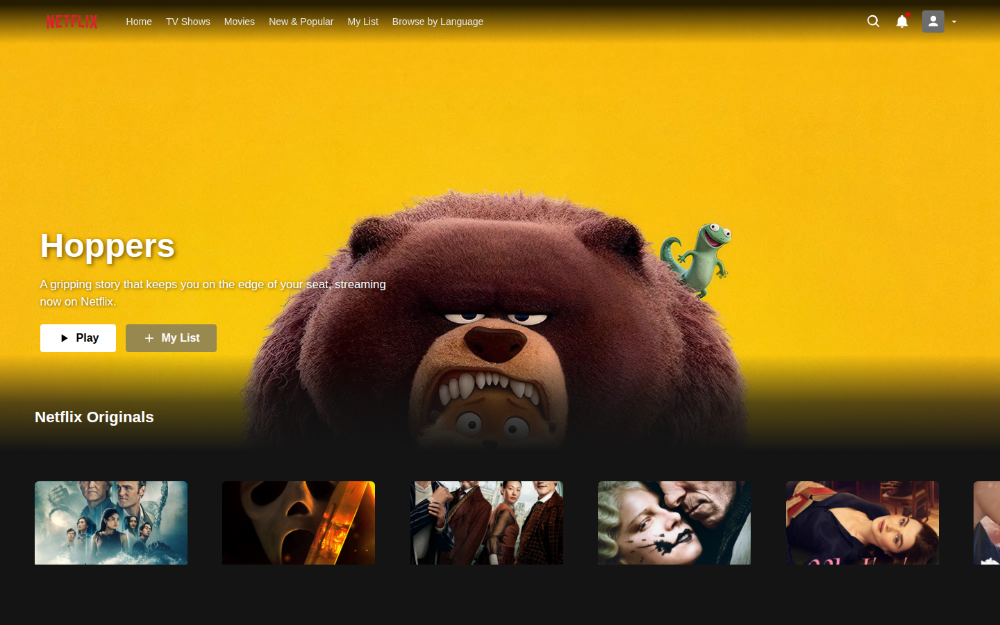

# Netflix Clone

A Netflix landing-page clone built with **React + Vite**, with live movie data
from the **TMDB** API. Header, banner, hover cards, sliders, and footer.



## Run locally

```bash
npm install
cp .env.example .env          # add your TMDB v3 API key
npm run dev                   # http://localhost:5173
```

Get a free TMDB key at <https://www.themoviedb.org/settings/api>. Without a key,
the app falls back to bundled placeholder images.

## Scripts

- `npm run dev` — dev server
- `npm run build` — production build (`dist/`)
- `npm run preview` — preview the build

## Deploy (Netlify)

Import the repo on Netlify — `netlify.toml` sets the build (`npm run build`,
publish `dist`) and SPA redirect. Add `VITE_TMDB_API_KEY` in the site's
environment variables for live data.
